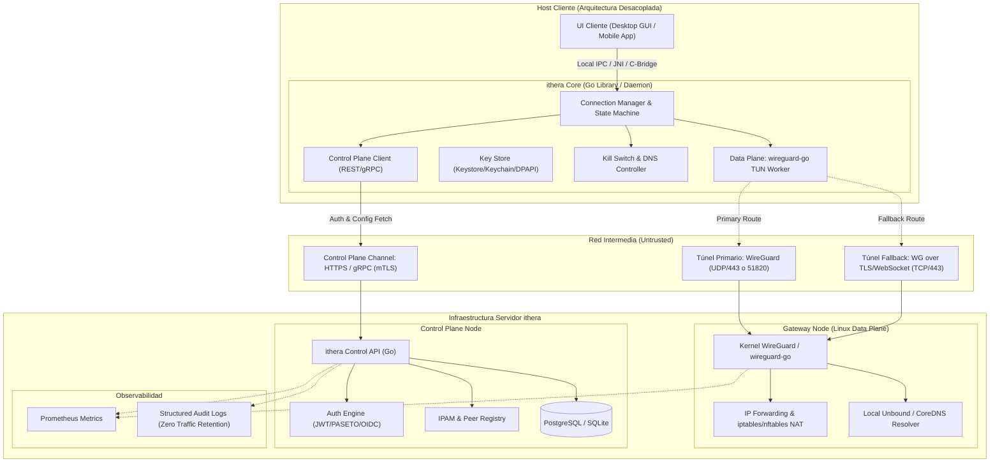
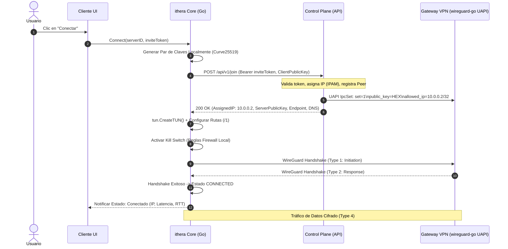
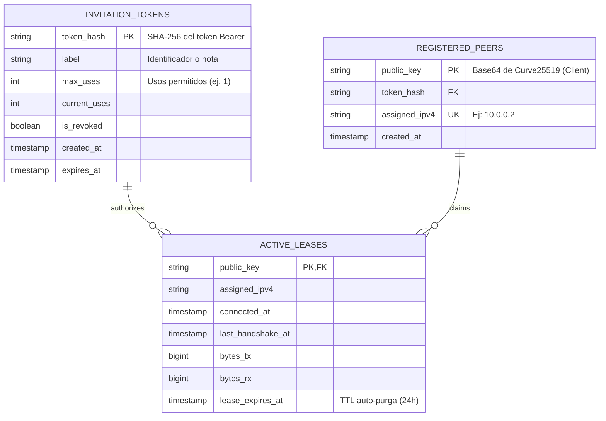

# Documento de Arquitectura y Especificación Técnica: Project ithera-vpn

**Versión:** 1.0.0-draft  
**Estado:** Propuesta de Arquitectura (Fase 0)  
**Autor:** Antigravity Architect & Engineering Team  
**Fecha:** Septiembre 2026  

---

## 1. Descripción General del Proyecto

### 1.1 Misión y Visión
**ithera-vpn** es un sistema VPN modular, de alto rendimiento y grado de ingeniería profesional, diseñado específicamente para garantizar la conectividad, privacidad e integridad del tráfico en redes con restricciones severas (entornos académicos restringidos, redes corporativas con inspección agresiva y enlaces de alta pérdida).

El proyecto persigue un doble propósito:
1. **Propósito Educativo y de Investigación:** Servir como plataforma rigurosa para aprender **Go** en sistemas de red de bajo nivel, dominar protocolos de túneles criptográficos (Noise Protocol Framework, WireGuard), entender la pila de red del kernel (TUN/TAP, Netlink, WFP, NetworkExtension) y estudiar el comportamiento del tráfico frente a firewalls e inspección profunda de paquetes (DPI).
2. **Propósito de Ingeniería de Software:** Diseñar un sistema robusto, con separación estricta entre el **Plano de Datos (Data Plane)** y el **Plano de Control (Control Plane)**, preparado para evolucionar desde un prototipo funcional (PoC) hasta un sistema cliente-servidor distribuido multiplataforma, aplicando patrones de diseño limpios y prácticas *secure-by-default*.

### 1.2 Filosofía de Diseño
* **No inventar criptografía (*Don't roll your own crypto*):** Toda la confidencialidad, autenticación e intercambio de claves descansa sobre estándares formalmente verificados (WireGuard / Noise IKpsk2 / ChaCha20-Poly1305 / Curve25519 / BLAKE2s).
* **Desacoplamiento Estricto:** El motor que transporta y encripta paquetes no conoce de bases de datos, usuarios ni tokens JWT. El plano de control orquesta; el plano de datos procesa bytes a velocidad de línea.
* **Transparencia y Realismo Técnico:** No existen soluciones mágicas "antibloqueo universal". Se diseñan capas de transporte resilientes y mecanismos de fallback medibles técnica y experimentalmente.
* **Privacidad por Defecto (*Privacy-by-Design*):** Zero logs de navegación en el servidor, rotación de claves efímeras y prevención activa de fugas (*leaks*) de DNS e IPv6 a nivel del sistema operativo.

---

## 2. Requisitos del Sistema

### 2.1 Requisitos Funcionales (RF)
* **RF-01 (Túnel Criptográfico Punto a Punto):** Encapsulación y cifrado de paquetes IP (IPv4 e IPv6) entre el cliente y el gateway VPN mediante el protocolo WireGuard.
* **RF-02 (Gestión de Identidades y Autenticación):** Autenticación de usuarios en el Plano de Control mediante tokens firmados (JWT/PASETO o mTLS) previo al aprovisionamiento de credenciales de túnel.
* **RF-03 (Aprovisionamiento Dinámico de Claves):** Capacidad del cliente de generar sus pares de claves WireGuard localmente (`Curve25519`) e intercambiar la clave pública con el servidor mediante API REST/gRPC segura.
* **RF-04 (IPAM - Gestión de Direcciones IP):** Asignación dinámica o reservada de IPs virtuales (`10.x.x.x/24` o `fd00::/64`) a clientes activos sin colisiones.
* **RF-05 (Kill Switch / Prevención de Fugas):** Bloqueo total del tráfico saliente en el cliente si el túnel se degrada o desconecta inesperadamente, evitando exponer la IP pública real.
* **RF-06 (DNS Seguro y Forzado):** Redirección obligatoria de todas las consultas DNS del host cliente hacia los servidores DNS del túnel, previniendo secuestros o envenenamientos locales.
* **RF-07 (Reconexión y Movilidad de Red - Roaming):** Mantenimiento de la sesión VPN ante cambios de interfaz de red en el cliente (ej. transición de Wi-Fi a datos móviles o cambio de AP) sin renegociación completa.
* **RF-08 (Monitoreo de Estado y Métricas de Conexión):** Visualización en tiempo real en el cliente de: latencia (RTT), paquetes transmitidos/recibidos, estado del handshake y último keepalive.
* **RF-09 (Control Remoto de Sesiones):** Capacidad de revocar peers desde el Plano de Control (desconexión forzada y expiración de sesión).
* **RF-10 (Transmisión Alternativa / Transporte Resiliente):** Soporte en el cliente y servidor para encapsular o adaptar el tráfico WireGuard sobre transportes secundarios (ej. WebSocket/TLS o TCP fallback) cuando el tráfico UDP saliente esté completamente restringido.

### 2.2 Requisitos No Funcionales (RNF)
* **RNF-01 (Rendimiento y Throughput):** El Data Plane en Go (`wireguard-go`) o módulo kernel debe sostener un throughput mínimo de saturación del enlace en entornos Gigabit con uso eficiente de CPU mediante pools de memoria (`sync.Pool`).
* **RNF-02 (Baja Latencia y Sobrecarga en Modo UDP):** La sobrecarga agregada por el túnel no debe superar el 5% en RTT respecto a la conexión directa bajo condiciones normales de red. *(Nota crítica: Este RNF aplica exclusivamente al Data Plane sobre UDP nativo. En modo fallback TCP/WebSocket, se asumen penalizaciones inherentes de latencia y Head-of-Line blocking por TCP-over-TCP).*
* **RNF-03 (Consumo de Memoria en Clientes):** En entornos móviles (iOS Network Extension), el proceso del túnel debe mantenerse holgadamente por debajo del límite de Jetsam del sistema operativo (históricamente ~15 MB, expandido en iOS moderno a ~35-50 MB). En clientes de escritorio, el servicio en segundo plano debe consumir menos de **35 MB**.
* **RNF-04 (Seguridad Criptográfica y Re-keying):** Cifrado autenticado AEAD ChaCha20-Poly1305, intercambio Diffie-Hellman en Curve25519, hashing con BLAKE2s. Secrecía perfecta hacia adelante (PFS) mediante los temporizadores formales de WireGuard: re-keying automático tras `REKEY_AFTER_TIME = 120s` o al alcanzar `REKEY_AFTER_MESSAGES = 2^60` paquetes; descarte de sesión si no hay rekey tras `REJECT_AFTER_TIME = 180s`.
* **RNF-05 (Política de Logs y Purga Operativa por Inactividad):** Política estricta de *Cero Registros de Tráfico*. No se registran IPs de destino, dominios DNS ni payloads. Dado que WireGuard es un protocolo estrictamente sin estado de conexión (*connectionless* sin paquete de desconexión), la purga de leases en `ACTIVE_LEASES` se rige por una **definición operativa de inactividad**: se inspecciona periódicamente `last_handshake_time` vía UAPI; si supera un umbral configurable de inactividad (default: 3 minutos) o al alcanzar el TTL máximo (24 horas), el peer es removido de la memoria y del dispositivo `wireguard-go`.
* **RNF-06 (Portabilidad y Modularidad):** El núcleo de red debe poder compilarse para Linux, Windows, macOS, Android (AAR) e iOS (XCFramework).
* **RNF-07 (Tolerancia a Fallos y Reconexión Automática):** Backoff exponencial en caso de fallo de red con reintentos controlados sin bloqueo del hilo principal.
* **RNF-08 (Mantenibilidad y Calidad de Código):** Cobertura de pruebas unitarias superior al 80% en la lógica de negocio y paquetes internos de Go; aprobación sin advertencias de linters estrictos (`golangci-lint`).

---

## 3. Restricciones del Sistema

1. **Restricción de Privilegios del SO:** La creación y configuración de interfaces virtuales (TUN/TAP) y la manipulación de la tabla de enrutamiento requieren privilegios elevados (`CAP_NET_ADMIN` en Linux, servicio `SYSTEM` en Windows, `root` en macOS). El cliente debe separar el proceso con privilegios del proceso de interfaz de usuario.
2. **Restricciones de Sandbox en Móviles:**
   * **Android:** El tráfico debe pasar por `android.net.VpnService`, que provee un descriptor de archivo (`ParcelFileDescriptor`) hacia un dispositivo TUN en espacio de usuario.
   * **iOS:** El túnel debe ejecutarse dentro de un `NEPacketTunnelProvider` (Network Extension). Apple impone límites estrictos de memoria (~15-30 MB) y tiempo de inicialización (< 5 segundos).
3. **Restricciones de Red:**
   * Redes que bloquean todo tráfico UDP saliente excepto puerto 53 (DNS) o 123 (NTP).
   * Redes que alteran o interceptan paquetes TCP SYN para forzar proxies HTTP.
   * Redes con MTU efectiva inferior a 1500 bytes (PPPoE, túneles intermedios) que descartan paquetes fragmentados.
4. **Restricción Criptográfica:** Prohibición absoluta de crear algoritmos de cifrado o protocolos propietarios desde cero. Se utiliza la especificación formal de WireGuard / Noise Protocol Framework.

---

## 4. Análisis de Redes Restrictivas

Para diseñar una solución resistente, es indispensable caracterizar técnicamente las capas de filtrado comunes en redes académicas y corporativas:

```
+-------------------------------------------------------------------------+
|                  TAXONOMÍA DE FILTRADO EN RED                           |
+-------------------------------------------------------------------------+
| L3/L4: Bloqueo de IPs y Puertos   -> Descarte de UDP/51820, subredes VPN|
| L4: Bloqueo de Protocolo UDP     -> Política Default-Deny UDP          |
| L7: DNS Filtering / Redirection   -> Hijacking de consultas puerto 53   |
| L7: Deep Packet Inspection (DPI)  -> Huellas de handshakes y tamaños    |
| L7: Stateful Packet Inspection   -> Timeout agresivo en tablas NAT     |
| L2/L3: MTU / PMTUD Blackholes     -> Descarte silencioso de ICMP Type 3 |
+-------------------------------------------------------------------------+
```

### 4.1 Mecanismos de Filtrado y Estrategias Técnicas de Mitigación

| Vector de Filtrado | Comportamiento en la Red | Impacto en VPN Estándar | Estrategia de Mitigación en `ithera-vpn` |
| :--- | :--- | :--- | :--- |
| **Bloqueo por Puerto L4** | Bloqueo de puertos no estándar (ej. solo permiten 80, 443, 53). | WireGuard por defecto (UDP 51820) falla de inmediato. | Permitir configurar el servidor para escuchar en puertos estándar: **UDP 443** o **UDP 53**. *(Advertencia: esto sólo elude filtros estáticos por puerto; no es efectivo contra DPI).* |
| **DPI de Handshake (WireGuard)** | Identificación de firmas WireGuard: Packet Type 1 (148 bytes, byte `0x01`), Type 2 (92 bytes, `0x02`), Type 3 (64 bytes). | Firewalls L7 (Fortinet, Palo Alto, GFW) descartan el flujo aunque use el puerto 443 o 53. | **Padding / Magic Header Injection (Fase 2):** Inyección de ruido/padding variable en el handshake y ofuscación de los primeros 4 bytes de cabecera antes de enviar el paquete por la red, destruyendo la firma fija de 148 bytes. |
| **Bloqueo de UDP Total** | Firewalls corporativos o proxies restrictivos descartan todo paquete UDP saliente (default-deny UDP). | WireGuard nativo no puede operar (diseñado sobre UDP). | **Mecanismo Fallback de Transporte:** Encapsulación de tramas WireGuard sobre WebSocket con TLS 1.3 / TCP sobre puerto 443. *(Trade-off asumido: penalización de latencia y riesgo de Head-of-Line blocking por TCP-over-TCP).* |
| **DNS Hijacking** | La red redirige o resuelve las consultas DNS a través de su propio resolver para bloquear accesos o forzar portales cautivos. | DNS Leak: el tráfico web se resuelve en la red local y es filtrado. | **DNS Tunnelling Obligatorio:** Todo el tráfico UDP/TCP puerto 53 es capturado por el TUN y enviado a un resolver local del servidor VPN o vía DNS-over-HTTPS (DoH) dentro del túnel. |
| **MTU / TCP Blackhole** | Descarte de paquetes ICMP "Fragmentation Needed" (Path MTU Discovery roto) sumado a la sobrecarga de cabeceras IP/UDP/WireGuard. | La conexión VPN se establece pero las páginas web o transferencias grandes se congelan en el handshake TLS. | **MSS Clamping Automático:** Ajuste forzado del `TCP MSS` en el túnel (`MTU - 40 bytes` en IPv4) y cálculo conservador de MTU base (ej. 1280 o 1360 bytes). |
| **Timeouts Agresivos de NAT** | Dispositivos NAT intermedios purgan estados de conexión UDP inactivas tras 20-30 segundos. | El cliente deja de recibir paquetes entrantes tras periodos breves de inactividad. | **Keepalive Adaptativo:** Envío de paquetes periódicos vacíos de keepalive configurables (ej. 25 segundos) para mantener activa la tabla de estados NAT. |

> [!IMPORTANT]
> **Postura de Ingeniería:** No existe la "indetectabilidad absoluta". La solución de `ithera-vpn` se enfoca en resiliencia de capas de transporte estandarizadas (UDP nativo -> UDP en puertos de alta prioridad -> TLS/WebSocket TCP fallback) manteniendo la observabilidad sobre el canal que se está utilizando.

---

## 5. Threat Model Inicial (Modelo de Amenazas)

Aplicamos la metodología **STRIDE** contextualizada al ciclo de vida del cliente VPN y la infraestructura del servidor:

```
                              ZONA HOSTIL (Red Local / ISP / WiFi Público)
                                                :
 [Cliente ithera] === (Túnel Cifrado WireGuard) === [Gateway VPN] ===> [Internet Legítimo]
         |                                      :         |
         | (API Control Plane / mTLS o HTTPS)   :         |
         +------------------------------------->: [Control Plane API / DB]
```

### 5.1 Análisis de Amenazas STRIDE

| Categoría | Amenaza Concreta | Vector de Ataque | Mitigación Arquitectónica |
| :--- | :--- | :--- | :--- |
| **Spoofing** (Suplantación) | Un atacante suplanta el gateway VPN o un cliente suplanta a otro peer. | Falsificación de respuestas DNS; inyección de paquetes IP en la interfaz TUN. | WireGuard implementa *Cryptokey Routing*: cada clave pública está ligada estrictamente a una IP de origen permitida (`AllowedIPs`). Si un paquete tiene una IP no autorizada para esa clave, el kernel lo descarta silenciosamente. |
| **Tampering** (Manipulación) | Manipulación de paquetes en tránsito por parte del ISP o firewall intermedio. | Inyección de paquetes RST, alteración de payloads. | Cifrado autenticado AEAD ChaCha20-Poly1305 con etiquetas MAC de 128 bits. Cualquier byte alterado invalida la autenticación y el paquete es descartado. |
| **Repudiation** (Repudio) | Un usuario realiza una acción hostil y niega haber participado. | Conexiones sin identificación ni trazabilidad en tiempo real. | **Compromiso Explícito (Privacy-First):** Para evitar registrar el historial de los usuarios, no existe persistencia histórica indefinida de sesiones pasadas ni destinos. Durante una conexión activa, la tabla en memoria/SQLite de **Leases Activos** asocia la IP virtual asignada a la clave pública y al token de invitación validado. Este registro se purga inmediatamente al terminar la sesión o tras un TTL máximo de 24h. |
| **Information Disclosure** (Fuga de Información) | **DNS Leaks:** Consultas escapan fuera del túnel.<br>**IPv6 Leaks:** Red con dual-stack envía IPv6 en claro.<br>**WebRTC Leaks:** Navegador expone IP local. | Prioridad incorrecta en la tabla de rutas del SO; resolver DNS del router local persiste como primario. | **1. Enrutamiento Global:** Rutas `0.0.0.0/1` y `128.0.0.0/1` (más específicas que `0.0.0.0/0`) que capturan todo el tráfico IPv4 sin destruir la ruta por defecto.<br>**2. Bloqueo o Enrutamiento IPv6:** Si el servidor no ofrece IPv6, el cliente bloquea activamente todo tráfico IPv6 saliente en el firewall local (Kill Switch). |
| **Denial of Service** (DoS) | Inundación de handshakes falsificados al servidor VPN; saturación de recursos criptográficos. | Envío masivo de paquetes de iniciación falsificados con IPs de origen aleatorias. | WireGuard implementa un mecanismo de **Cookies con Hash de MAC2**: ante sobrecarga de CPU, el servidor responde con cookies cifradas usando una clave pública de cookie (`cookie_reply`), obligando al cliente a demostrar posesión de IP antes de computar Diffie-Hellman pesado. |
| **Elevation of Privilege** (Elevación de Privilegios) | El proceso cliente no privilegiado (GUI) manipula el servicio del sistema para ejecutar código como `root`/`SYSTEM`. | Inyección en el canal IPC (Named Pipes o Unix Domain Sockets). | Validación estricta de esquemas en el canal IPC; el daemon privilegiado sólo expone comandos atómicos de red (`StartTunnel(config)`, `StopTunnel()`, `GetStatus()`) y valida permisos de socket (`chmod 0600` o DACLs en Windows). |

---

## 6. Comparación Tecnológica Exhaustiva

### 6.1 Backend / VPN Server: Go como Núcleo

* **¿Por qué Go?**
  * **Rendimiento de Concurrencia:** Modelo CSP con goroutines ligeras y canales ideal para multiplexar I/O de red de miles de túneles concurrentes.
  * **Implementación Oficial:** El equipo de WireGuard mantiene `golang.zx2c4.com/wireguard`, una implementación pura en espacio de usuario altamente optimizada con soporte para vectorización SIMD de ChaCha20-Poly1305.
  * **Binarios Estáticos y Mínima Superficie de Ataque:** Sin dependencias dinámicas ni runtime pesado (a diferencia de Node.js o Python); menor superficie que C/C++ frente a vulnerabilidades de memoria (buffer overflows).
  * **Ecosistema de Red:** Soporte de primer nivel para APIs Netlink (`vishvananda/netlink`), gRPC, OpenTelemetry y Prometheus.

### 6.2 Clientes: Evaluación Multiplataforma

Analizamos las opciones para estructurar la aplicación cliente en Android, iOS, Windows, Linux y macOS:

| Criterio | Opción 1: Nativo Puro (Kotlin + Swift + Go Desktop) | Opción 2: Híbrido Decoupled (Go Shared Core + UIs Nativas) *(Recomendada)* | Opción 3: Flutter + FFI a Go Core | Opción 4: React Native | Opción 5: Kotlin Multiplatform (KMP) |
| :--- | :--- | :--- | :--- | :--- | :--- |
| **Rendimiento de Red** | Máximo (Nativo). | Máximo (Motor Go nativo enlazado como C-Archive o binario). | Alto (Dart FFI). | Medio (Puente JS/TurboModules agrega overhead innecesario). | Alto (compilación nativa Kotlin/Native). |
| **Consumo de Memoria** | Excelente (~10-15 MB). | Excelente (~12-18 MB en túnel móvil). | Regular (Flutter Engine agrega ~30 MB solo para la UI). | Pobre (Runtime JS consume 40-70 MB). | Bueno (~20 MB). |
| **Integración con APIs VPN del SO** | Nativa directa (`VpnService`, `NetworkExtension`, `Wintun`). | Nativa directa para el adapter del SO + Go Core para la lógica de túnel. | Requiere escribir MethodChannels nativos en Java/Swift para las APIs VPN. | Requiere Native Modules complejos; alto riesgo de inestabilidad. | Requiere bindings complejos en Kotlin/Native para llamar APIs C/ObjC. |
| **Facilidad de Mantenimiento** | Media (3 bases de código de UI y red independientes). | **Muy Alta:** Un solo motor VPN/Control Plane en Go probado unitariamente; interfaces visuales delegadas. | Media (UI compartida, pero los plugins de VPN son 100% nativos). | Baja (Ecosistema inestable para servicios de red en background). | Media (Ecosistema KMP para escritorio y iOS aún requiere glue-code). |
| **Porcentaje de Código Compartido** | ~10% (solo modelos/specs). | **~60-70%** (Toda la lógica de túnel, DNS, config, crypto y API client en Go). | ~70% de UI, ~30% de backend nativo. | ~60% de UI, plugins nativos complejos. | ~50% compartido en lógica. |
| **Riesgo en iOS Network Extension** | Mínimo. | Controlado (compilación `wireguard-go` con `CGO_ENABLED=1` y tuning de GC). | **Crítico:** Flutter Engine no puede correr dentro del `PacketTunnelProvider`. | **Inviable:** Node/Hermes no puede correr dentro del límite de memoria de iOS. | Alto (Kotlin/Native runtime en extensiones pequeñas suele presentar fugas o picos de memoria). |
| **Veredicto Arquitectónico** | Viable pero triplica esfuerzo de testing. | **GANADORA (Arquitectura Desacoplada y Escalable).** | Aceptable únicamente para la UI, no para el motor de túnel. | **Descartada.** | Viable a futuro, pero Go ya resuelve el core. |

#### Justificación de la Arquitectura Seleccionada: "Decoupled Shared Core"
1. **El túnel NO es una aplicación común:** Los sistemas operativos móviles aíslan el túnel en un proceso independiente (ej. `Extension` en iOS, `Service` en Android). Poner frameworks de UI (React Native, Flutter) dentro del túnel es un error de arquitectura que causa crasheos por Jetsam/OOM.
2. **El Core de Red pertenece a Go:** Toda la lógica de control plane, serialización, ping de servidores, reintentos, cifrado de archivos locales y túnel `wireguard-go` reside en un módulo Go (`libithera`).
3. **Móvil (Android / iOS):**
   * Go se compila como biblioteca compartida (`.aar` en Android mediante Gomobile / Android NDK, y `.xcframework` en iOS mediante Gomobile / C-archive).
   * La UI móvil se desarrolla en **Kotlin (Jetpack Compose)** para Android y **Swift (SwiftUI)** para iOS, invocando al Core de Go para la ejecución y comunicándose mediante descriptores de archivo nativos (`TUN fd`).
4. **Escritorio (Windows / Linux / macOS):**
   * Un **Daemon de Go (`itherad`)** corre como servicio de fondo con privilegios (`SYSTEM` / `root`).
   * La UI de escritorio puede ser nativa ligera (ej. Wails en Go + HTML/CSS o Flutter desktop) comunicándose con el daemon a través de un canal **IPC local autenticado**.

---

## 7. Arquitectura Propuesta del Sistema

El sistema implementa una separación formal en tres capas: **Plano de Datos (Data Plane)**, **Plano de Control (Control Plane)** y **Plano de Gestión (Management Plane)**.



### 7.1 Componentes del Sistema

1. **`ithera-core` (Go Shared Engine):**
   * **State Machine:** Gestiona los estados del cliente (`Disconnected`, `Authenticating`, `Connecting`, `Connected`, `Reconnecting`, `Error`).
   * **Device Key Management:** Genera claves privadas en memoria; nunca las expone al plano de control.
   * **Virtual Adapter Manager:** Enlaza el descriptor TUN del SO con el motor de cifrado.
   * **DNS & Route Enforcer:** Configura las interfaces para evitar fugas.
2. **`ithera-server` (Gateway & Control API):**
   * **Data Plane Worker:** Gestiona el dispositivo `wireguard-go` en userspace y la interfaz TUN.
   * **Node Coordinator:** Asigna bloques CIDR a los clientes y sincroniza peers con el dispositivo `wireguard-go` a través de la **UAPI (Userspace API / `device.IpcSet`)** mediante el protocolo estándar de control IPC sobre socket UNIX o memoria.
   * **Auth Handler:** Valida identidad/tokens y genera configuraciones de túnel en tiempo real.
3. **Mecanismo Fallback de Transporte & Ofuscación (Decorador de `conn.Bind`):**
   * **Punto de Extensión Canónico:** En `wireguard-go`, el punto de integración no requiere modificar el core del protocolo ni hacer forks difíciles de mantener. Se implementa respetando la firma moderna de procesamiento por lotes (*batching*) de la interfaz `conn.Bind` (`Send(bufs [][]byte, ep conn.Endpoint) error` y `ReceiveFunc(bufs [][]byte, sizes []int, eps []conn.Endpoint) (int, error)`).
   * **Orden de Composición Estricto:**
     * `obfsBind` envuelve exclusivamente a un `conn.Bind` de UDP nativo (`conn.NewDefaultBind()`).
     * `wsBind` es una implementación alternativa e independiente de `conn.Bind` que transporta datagramas sobre WebSocket/TLS (TCP 443). **No se compone `obfsBind` sobre `wsBind`**, dado que TLS 1.3 ya provee confidencialidad y oculta completamente los patrones y cabeceras de los paquetes.
   * **Derivación de Parámetros Anti-DPI (Fase 2b):** Los parámetros de ofuscación (valores de los bytes mágicos de cabecera y rango de padding variable) **nunca están cableados en el código**; se derivan criptográficamente a partir de un secreto pre-compartido (PSK/Seed) mediante HKDF-SHA256 en tiempo de negociación/configuración. El padding se calcula garantizando que nunca supere el MTU asignado ni desborde los buffers pre-alocados de la piscina.
   * **Costo Técnico Asumido en Fallback (TCP-over-TCP):** El modo `wsBind` induce *Head-of-Line blocking* y penalización de RTT. Es un mecanismo de supervivencia estricto ante el bloqueo total de UDP.

---

## 8. Diagrama de Secuencia: Flujo de Conexión Seguro



---

## 9. Estructura de Repositorio y Directorios

Adoptamos una arquitectura **Monorepo** con el estándar oficial de Go (*Standard Go Project Layout*), centralizando el código del backend, las herramientas de desarrollo y los wrappers de clientes:

```
ithera-vpn/
├── .github/
│   └── workflows/              # Pipelines de CI/CD (lint, test, build)
├── cmd/
│   ├── itheraclient/           # Cliente CLI de desarrollo y conexión (Fases 1-3)
│   ├── itheractl/              # CLI de administración e inspección de estado
│   └── itherasrv/              # Servidor (wireguard-go userspace + Control API)
├── configs/
│   ├── client.example.yaml     # Configuración de ejemplo para el cliente CLI
│   └── server.example.yaml     # Configuración de ejemplo del servidor
├── docs/
│   ├── adr/                    # Architecture Decision Records (ADRs)
│   ├── threat-model/           # Documentación extendida de amenazas
│   └── architecture/           # Blueprint y especificaciones técnicas
├── internal/                   # Código interno de la solución
│   ├── auth/                   # Tokens de invitación (Bearer), hashes y validación
│   ├── config/                 # Parser y validador de configuración tipada
│   ├── datastore/              # Repositorio SQLite embebido (peers, tokens, leases)
│   ├── device/                 # Envoltorio de wireguard-go Device y UAPI (IpcSet)
│   ├── ipam/                   # Gestor de asignación de direcciones IP en memoria/DB
│   ├── routing/                # Reglas de enrutamiento (/1), DNS local y TCP MSS clamping
│   ├── transport/              # Decoradores de conn.Bind (obfsBind anti-DPI, wsBind fallback)
│   └── tun/                    # Inicialización y gestión de interfaces TUN (wireguard-go/tun)
├── test/
│   ├── integration/            # Scripts de pruebas en Linux Network Namespaces (run_poc.sh)
│   └── testdata/               # Claves y configuraciones fijas para testing
├── .golangci.yml               # Configuración de linters de Go
├── go.mod                      # Módulo raíz de Go
└── go.sum
```

---

## 10. Estrategia de Comunicación entre Componentes

```
+---------------------------------------------------------------------------------+
|                               MATRIZ DE COMUNICACIÓN                            |
+---------------------+-------------------+---------------------+-----------------+
| Enlace              | Protocolo Base    | Formato Payload     | Seguridad       |
+---------------------+-------------------+---------------------+-----------------+
| Client GUI <-> Core | IPC Local         | JSON-RPC o Protobuf | Permisos SO /   |
| (Desktop)           | (UDS/Named Pipes) |                     | Tokens locales  |
| Client Core <-> CP  | HTTPS / HTTP/2    | REST JSON / gRPC    | TLS 1.3 / mTLS  |
| Client <-> Gateway  | UDP (Primario)    | WireGuard Type 1-4  | Noise IKpsk2    |
| Client <-> Gateway  | TCP/WebSocket     | Framing binario WG  | TLS 1.3         |
| (Fallback)          | (Secundario)      |                     |                 |
+---------------------+-------------------+---------------------+-----------------+
```

### 10.1 Mecanismo IPC para Clientes de Escritorio
En Windows y Linux, la interfaz de usuario corre en el contexto de usuario no privilegiado, mientras que la manipulación de la interfaz de red exige privilegios de administrador.
* **Linux / macOS:** Socket de dominio Unix (`/var/run/itherad.sock`) con permisos `0660` asignado a un grupo de usuarios `ithera`.
* **Windows:** Canal de comunicación con nombre (*Named Pipe* `\\.\pipe\itherad`) protegido con descriptores de seguridad (DACLs) que sólo permiten lectura/escritura a procesos con token de autenticación local.

---

## 11. Modelo de Datos Inicial (Control Plane Mínimo en SQLite)

Diseñado para persistencia embebida en **SQLite** durante la Fase 3, enfocándose en la simplicidad y en el principio de mínimo privilegio criptográfico (el servidor **solo almacena claves públicas**):



> [!NOTE]
> **Política de Retención y Cero Registros:**
> * `ACTIVE_LEASES` representa únicamente el estado en caliente de los clientes conectados para control IPAM y cálculo de métricas agregadas. Al desconectarse o tras vencer `lease_expires_at`, el registro es eliminado.
> * Las claves privadas (`Curve25519`) **jamás tocan el servidor** ni se persisten en base de datos; residen exclusivamente en memoria del cliente (`itheraclient`).

---

## 12. Estrategia de Configuración

Seguimos estrictamente los principios de **12-Factor App**:
1. **Prioridad Jerárquica:**
   `Flags CLI` > `Variables de Entorno` > `Archivo YAML/JSON` > `Valores por Defecto`.
2. **Estructura Tipada y Validada:** Uso de bibliotecas estándar o consagradas (`caarlos0/env` o `spf13/viper`) complementadas con `go-playground/validator` en el arranque del servicio.
3. **Detección Temprana de Errores (*Fail Fast*):** Si una clave criptográfica tiene longitud incorrecta, o una subred IPAM es inválida, el binario termina con código de error explicativo antes de abrir sockets.

---

## 13. Estrategia de Testing y Calidad

Para un sistema que interactúa con la pila de red del sistema operativo, las pruebas unitarias tradicionales son insuficientes:

1. **Pruebas Unitarias (Nivel 1):**
   * Lógica de codificación/decodificación de paquetes.
   * State Machine y transiciones de estado.
   * Asignación de rangos IPAM y validaciones criptográficas.
2. **Pruebas de Integración con Linux Network Namespaces (Nivel 2):**
   * Go ejecutado en Linux permite crear espacios de nombres de red aislados (`ip netns`).
   * Se crea un namespace `client_ns` y un namespace `server_ns` interconectados por un par `veth`.
   * Se levanta la interfaz TUN en cada namespace, se ejecuta el handshake real de WireGuard y se transmite tráfico TCP/UDP real, midiendo pérdida de paquetes y reconexiones sin necesidad de máquinas virtuales externas.
3. **Pruebas de Resiliencia de Red y MTU (Nivel 3):**
   * Simulación de enlaces degradados usando `tc` (Traffic Control / NetEm): introducción de 50ms de latencia, 5% de pérdida de paquetes y MTU reducida a 1300 bytes para validar la auto-negociación de MSS.
4. **Análisis Estático y Seguridad:**
   * `golangci-lint` con linters habilitados: `govet`, `staticcheck`, `errcheck`, `gosec`, `revive`, `noctx`.
   * `govulncheck` en cada pipeline de CI para detectar vulnerabilidades en el árbol de dependencias.

---

## 14. Estrategia de Observabilidad (Privacy-Preserving)

La observabilidad en un software VPN debe conciliar la detección de fallas con el respeto absoluto a la privacidad del usuario:

* **Logging Estructurado:** Uso de `log/slog` de la biblioteca estándar de Go.
  * Formato JSON en producción, texto legible en desarrollo.
  * **Filtro de Datos Sensibles (*Log Sanitizer*):** Una regla a nivel de middleware intercepta y enmascara direcciones IP públicas de los clientes y prohíbe explícitamente loguear URLs o paquetes del payload de datos.
* **Métricas (Prometheus):**
  * `ithera_active_peers{node_id="gw-1"}`: Número de túneles establecidos.
  * `ithera_handshake_duration_seconds`: Histograma de tiempo de negociación de claves.
  * `ithera_bytes_total{direction="rx|tx"}`: Ancho de banda global del nodo.
  * `ithera_fallback_connections_active`: Conexiones operando sobre WebSocket/TLS.

---

## 15. Roadmap Re-alineado y Enfoque Pragmático

Para evitar la trampa de la sobre-especificación y asegurar avances tangibles inmediatos, **redefinimos el alcance del proyecto**:
* **Proyecto Central (Core / Meta Inmediata): Fases 1, 2 y 3 (mínima).**
* **Extensiones a Largo Plazo (Post-MVP): Fases 4, 5 y 6.**

```
================================================================================
                    NÚCLEO DEL PROYECTO (OBJETIVO REAL)
================================================================================
  FASE 0: Arquitectura y Decisiones Técnicas (Completada)
     │
     ▼
  FASE 1: PoC Túnel Punto a Punto en Go
          - namespaces de red Linux aislados (`client_ns` y `server_ns`)
          - interfaces TUN creadas con `wireguard-go/tun` (`tun.CreateTUN`)
          - handshake WireGuard y UAPI (`wireguard-go`)
          - verificación medible: PING 10.0.0.1 exitoso y tcpdump con tráfico cifrado
     │
     ▼
  FASE 2a: Data Plane Resiliente & Networking Core
          - TCP MSS Clamping automático y detección de MTU
          - prevención activa de DNS leaks (intercepción local y forzado)
          - reglas de enrutamiento global seguro (subredes `/1`)
     │
     ▼
  FASE 2b: Resiliencia de Transporte & Anti-DPI (Decoradores de conn.Bind)
          - decorador `obfsBind`: padding dinámico y alteración de firmas WireGuard
          - decorador `wsBind`: transporte fallback sobre WebSocket/TLS (TCP 443)
     │
     ▼
  FASE 3: Control Plane Mínimo (API + SQLite)
          - autenticación por Bearer Invitation Token con hash en SQLite
          - generación de claves Curve25519 estrictamente en el cliente
          - endpoint `/api/v1/join` para aprovisionamiento dinámico de IP y peer
================================================================================
            EXTENSIONES A LARGO PLAZO (SI SE DESEA CONTINUAR)
================================================================================
  FASE 4: Daemon de Escritorio e IPC Local (WFP / nftables)
  FASE 5: Clientes Móviles (Android VpnService / iOS NetworkExtension)
  FASE 6: Hardening, Observabilidad y Producción (CI/CD, Helm, Grafana)
================================================================================
```

### Detalle de las Fases del Núcleo

#### Fase 1: Proof of Concept (PoC) — Túnel Punto a Punto en Go *(Siguiente Paso)*
* **Objetivo:** Lograr un ping bidireccional entre dos network namespaces de Linux (`ip netns`) mediante cliente y servidor en Go, confirmando por captura de red que el tráfico cursa cifrado.
* **Qué se construye:**
  * Uso de la biblioteca oficial `golang.zx2c4.com/wireguard/tun` (`tun.CreateTUN`) para asignación de interfaces virtuales de forma robusta.
  * Paquete `internal/device`: inicialización de `device.NewDevice` y configuración inicial vía UAPI (`device.IpcSet`).
  * Binario CLI `cmd/itherasrv` (escucha en UDP, asigna IP `10.0.0.1/24`).
  * Binario CLI `cmd/itheraclient` (conecta al servidor, asigna IP `10.0.0.2/24`).
  * Script de automatización en Linux (`test/integration/run_poc.sh`) que levanta `ns-client` y `ns-server` con un par `veth`, ejecuta ambos binarios y corre `ping 10.0.0.1` verificando con `tcpdump`.
* **Qué NO se construye:** Base de datos, API REST, tokens, UI ni fallback.
* **Criterios de Aceptación:**
  1. `ping -c 3 10.0.0.1` responde con 0% de pérdida de paquetes a través de la interfaz `tun`.
  2. `tcpdump -i veth-srv` sólo muestra paquetes UDP WireGuard (handshake y Type 4 encrypted data); cero paquetes ICMP en texto plano en la red de transporte.

#### Fase 2a: Data Plane Resiliente & Networking Core
* **Objetivo:** Resolver problemas de paquetes perdidos por MTU y proteger contra fugas locales.
* **Qué se construye:**
  * Paquete `internal/routing`: cálculo dinámico de MTU y fijación forzada de `TCP MSS` (`MTU - 40 bytes`).
  * Configuración de rutas globales `/1` (`0.0.0.0/1` y `128.0.0.0/1`) para capturar todo el tráfico sin destruir la gateway por defecto.
  * Intercepción forzada de DNS (`UDP/53`) hacia el DNS del túnel para evitar DNS leaks.
* **Criterios de Aceptación:** Navegación web funcional a través del túnel con MTU restringida simulada (1300 bytes) y sin fugas de DNS en tests de resolución.

#### Fase 2b: Resiliencia de Transporte & Anti-DPI (Decoradores de `conn.Bind`)
* **Objetivo:** Eludir filtrado L7 por firmas de handshake y permitir conectividad en redes con descarte total de UDP.
* **Qué se construye:**
  * Decorador `obfsBind`: envuelve la interfaz `conn.Bind` de `wireguard-go` aplicando padding aleatorio a los datagramas salientes y alterando los bytes iniciales (Type 1-3) para evitar las firmas estáticas de 148 bytes (inspirado en la arquitectura de `amneziawg-go`).
  * Decorador `wsBind`: encapsula los paquetes WireGuard en tramas binarias sobre WebSocket/TLS (puerto TCP 443) como fallback de supervivencia cuando UDP está bloqueado.
* **Criterios de Aceptación:**
  1. El handshake inicial no es clasificado como WireGuard por analizadores heurísticos basados en longitud fija en `tcpdump`.
  2. Conectividad establecida y funcional incluso cuando una regla de firewall local descarta el 100% de los paquetes UDP salientes.

#### Fase 3: Control Plane Mínimo (API + SQLite)
* **Objetivo:** Automatizar la entrega de claves y direccionamiento IP sin intermediación manual y con seguridad estricta.
* **Qué se construye:**
  * Generación de claves privadas Curve25519 estrictamente en el cliente (`itheraclient`); el servidor jamás manipula ni conoce claves privadas de clientes.
  * Servidor de Control API en `cmd/itherasrv` con endpoint `POST /api/v1/join` expuesto **exclusivamente sobre TLS (HTTPS)** para evitar la intercepción del token en tránsito.
  * **Autenticación por Invitation Token:**
    * Tokens de un solo uso o usos acotados (`max_uses`) con fecha de expiración obligatoria.
    * Verificación contra el hash almacenado en SQLite mediante comparación en **tiempo constante** (`crypto/subtle.ConstantTimeCompare`) para evitar ataques de temporización (*timing attacks*).
  * **Protección Anti-Fuerza Bruta:** Rate limiter por IP de origen (ej. máximo 5 intentos fallidos por minuto antes de bloqueo temporal).
  * Aprovisionamiento dinámico: asignación de la siguiente IP disponible en `10.0.0.0/24`, persistencia de la clave pública en SQLite y registro del peer en el dispositivo `wireguard-go` en caliente vía UAPI.
* **Criterios de Aceptación:**
  1. Un cliente con token válido sobre HTTPS recibe su configuración y levanta el túnel.
  2. Tokens caducados, agotados o manipulados son rechazados con HTTP 401 Unauthorized sin revelar información de validez previa.
  3. Múltiples intentos fallidos consecutivos desde una misma IP disparan HTTP 429 Too Many Requests.
### Fases de Extensión (Post-MVP / Opcionales a Largo Plazo)


#### Fase 4: Daemon de Escritorio e Integración de Sistema (IPC)
* **Objetivo:** Proveer una experiencia de escritorio segura donde el proceso no privilegiado se desacopla del servicio del sistema.
* **Qué se construye:**
  * Servicio de fondo `itherad` con soporte para Windows Service y Linux systemd.
  * Mecanismo IPC (Named Pipes / Unix Domain Sockets) con protocolo RPC serializado.
  * Kill Switch local (WFP en Windows, nftables/iptables en Linux).
  * Cliente CLI interactivo para usuarios (`ithera connect`, `ithera status`).
* **Qué NO se construye:** Clientes para tiendas de aplicaciones móviles (Google Play / App Store).
* **Criterios de Aceptación:** Un usuario sin permisos de administrador puede iniciar la conexión a través de la CLI invocando al daemon local, con garantía de Kill Switch activo si el enlace cae.

#### Fase 5: Ecosistema Multiplataforma y UIs
* **Objetivo:** Llevar la solución a dispositivos móviles y ofrecer una UI visual moderna.
* **Qué se construye:**
  * Compilación de `ithera-core` como biblioteca compartida (AAR para Android, XCFramework para iOS).
  * Cliente Android en Kotlin con `VpnService`.
  * Cliente iOS en Swift con `NEPacketTunnelProvider`.
  * UI de escritorio moderna (Wails/Flutter Desktop) comunicada por IPC con el daemon.
* **Qué NO se construye:** Funcionalidades de facturación o multi-región compleja.
* **Criterios de Aceptación:** Aplicaciones funcionales en emuladores/dispositivos reales capaces de conectarse con un clic y navegar de forma segura.

#### Fase 6: Hardening, Observabilidad y Producción
* **Objetivo:** Preparar el proyecto para despliegue productivo y auditorías de seguridad.
* **Qué se construye:**
  * Contenedores Docker multi-etapa reforzados (imágenes distroless o Alpine mínimas).
  * Configuración de métricas Prometheus y dashboards Grafana pre-armados.
  * Pipelines de CI/CD completos con tests en namespaces y escaneo SAST.
  * Documentación completa para despliegue con Docker Compose / Helm.
* **Criterios de Aceptación:** Despliegue automatizado de un clúster de pruebas con un solo comando, con métricas visibles y cero hallazgos críticos en análisis estático.

---

## 16. Registro Inicial de Decisiones de Arquitectura (ADRs)

Para garantizar la trazabilidad de las decisiones de ingeniería, se proponen los siguientes ADRs fundamentales:

1. **ADR-001:** Selección de WireGuard como Protocolo Base frente a OpenVPN o IPsec.
   * *Problema:* Necesidad de un protocolo criptográfico auditado, de alto rendimiento y bajo consumo de batería en móviles.
   * *Decisión:* WireGuard por su moderna suite de cifrado, base de código compacta (~4,000 líneas vs ~100,000 de OpenVPN) y rendimiento superior en el kernel y en Go.
2. **ADR-002:** Adopción de Go para el Núcleo del Cliente y Servidor.
   * *Problema:* Mantener múltiples implementaciones de la lógica de red en C, Java, Swift y Go genera deuda técnica inmanejable.
   * *Decisión:* Centralizar la lógica en Go (`ithera-core`) y exportarla a Android/iOS mediante C-archive/Gomobile.
3. **ADR-003:** Arquitectura Desacoplada: UI No Privilegiada y Daemon Privilegiado.
   * *Problema:* Ejecutar una interfaz gráfica completa con permisos de Administrador/Root viola el principio de menor privilegio.
   * *Decisión:* Separar el proceso en una UI de usuario y un servicio `itherad` comunicado por IPC seguro.
4. **ADR-004:** Transporte Fallback sobre WebSocket/TLS.
   * *Problema:* Redes hostiles que bloquean selectivamente el tráfico UDP.
   * *Decisión:* Implementar una capa de encapsulación que encaje tramas WireGuard sobre conexiones WSS en el puerto 443 estándar, preservando la compatibilidad de extremo a extremo.
5. **ADR-005:** Estrategia Anti-Fugas (Kill Switch) basada en Enrutamiento y Firewall Nativo.
   * *Problema:* Fallos transitorios de red exponen la IP real o dejan escapar peticiones DNS locales.
   * *Decisión:* Enrutar subredes `/1` y configurar reglas de firewall que descarten cualquier paquete saliente que no vaya dirigido al endpoint del gateway VPN.

---

## 17. Matriz de Riesgos Técnicos y Mitigaciones

| Riesgo Técnico | Severidad | Probabilidad | Estrategia de Mitigación |
| :--- | :---: | :---: | :--- |
| **Límite de Memoria en iOS (Jetsam OOM)** | Alta | Media | Compilar Go con flags de optimización de tamaño (`-s -w`), ajustar el recolector de basura (`GOGC=20`), y evitar buffers excesivos en la extensión. |
| **Detección por DPI de Cabeceras WireGuard** | Media | Alta | Diseñar la capa de red con soporte modular para inyección de bytes aleatorios de padding (inspirado en AmneziaWG) o túnel WebSocket. |
| **Fragmentación de Paquetes / Fallos de MTU** | Alta | Media | Clampear automáticamente el TCP MSS a la MTU calculada de la interfaz TUN menos 40 bytes de cabecera TCP/IP. |
| **Complejidad de Mantenimiento en Plataformas Móviles** | Media | Media | Delimitar estrictamente el código de plataforma sólo a la llamada del sistema que entrega el descriptor TUN; el resto se resuelve en Go. |
| **Agotamiento de IPs en Servidor (IPAM)** | Baja | Baja | Reclamación automática de IPs de sesiones inactivas tras expiración de lease o timeout de inactividad prolongado. |

---

## 18. Próximos Pasos Inmediatos (Arranque de Fase 1)

Con la arquitectura aprobada, el trabajo técnico comenzará con:
1. **Inicialización del Módulo Go:** Creación del `go.mod` raíz (`github.com/pap0w/ithera-vpn`).
2. **Estructuración de Directorios:** Crear las carpetas base del layout estándar (`cmd/`, `internal/`, `pkg/`, `docs/adr/`).
3. **Redacción formal de ADR-001 a ADR-003** en `docs/adr/`.
4. **Prototipo PoC de Fase 1:** Implementar la apertura y lectura/escritura de un dispositivo TUN en Go y validar el paso de paquetes entre dos puntos.
